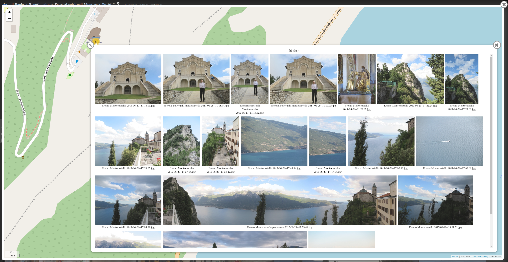

# MyPhotoShare version v4.9.35 (Feb 5, 2021)

### A Web Photo Gallery Done Right via Static JSON & Dynamic Javascript
#### by Jason A. Donenfeld (<Jason@zx2c4.com>), Jerome Charaoui (jerome@riseup.net)  Joachim Tingvold (joachim@tingvold.com), Paolo Benvenuto (<paolobenve@gmail.com>), Pierre Métras (<p.metras@videotron.ca>)

## Description

**MyPhotoShare** is an open source web photo gallery aimed at sleekness and speed. It works over directory structures rather than esoteric photo database management software. Everything it generates is static, which means it's extremely fast and secure.

It permits browsing the media by folder, date, search terms, geotags and maps. You can associate metadata (i.e. title, description, multi-word-any-character tags) with pictures and albums and search media content by keywords or display descriptions.

Whenever geotagged photos are found, a map with the photo(s) position can be shown using Leaflet, and clicking the photo markers the photo thumbnails for that point are shown.

Content (albums and media files) can be shared over some popular social plaforms or downloaded.

It is available in English, Italian, French and Spanish. Localizing to other languages is simple.

**MyPhotoShare** is a Jason A. Donenfeld's *photofloat* fork, enriched by Jerome Charaoui's patches permitting showing videos, Paolo Benvenuto's and Pierre Métras's following development.

[Check out a demo!](http://palmaro.qumran2.net/)

[What's great in version 5.0](doc/Features-5.0.md)

## Read more

* [Install and update procedure](doc/Install.md)
* [Utility scripts](doc/Scripts.md)
* [Gallery of MyPhotoShare screenshots](doc/Gallery.md)
* [Geotagging](doc/GPS.md)
* [Tweaking metadata with `album.ini`](doc/Metadata.md)
* [Make some content private](doc/Authentication.md)
* [User interface](doc/Navigation.md)
* [FAQ](doc/FAQ.md)
* [Versions changelog](doc/Changelog.md)
* [Debugging memory usage](doc/Debugging.md)
* [Known issues](doc/Issues.md)
* [License](License.md)

## Features

### Gallery

- [x] Manages images and videos, and permits sharing them (single image or album).
- [x] Media can be browsed by folder, by date or by geolocation. The user switches among album, date and place views.
- [x] Media and folders can be sorted ascending/descending, by date or by name.
- [x] Media can be searched by file/album name, title, description, tags; search may be whole word or inside words, considering accents and capitals or not, in current album (in virtual albums too) or in the whole tree.
- [x] Thumbnails can be square (cropped, with optional face detection by [OpenCV](https://opencv.org/)) or full-content.
- [x] Albums can be downloaded via the right menu, either with or without subalbums, either images only, videos only, or both.
- [x] Pictures can be automatically indexed and tagged with ML-based extensions.

### For Photographers

- [x] Photos with GPS data can be browsed by country/region-state/place; names are retrieves in choosen language from geonames.org web service.
- [x] Fullscreen mode.
- [x] EXIF, IPTC and XMP Metadata display.
- [x] Link to original media.
- [x] Link for direct download.
- [x] Menu entries for direct download of whole album, with or without its subalbums.
- [x] Allows enlarging the photo without any limit.
- [x] Installer can decide whether to replicate all Exif metadata (including copyright info) into all the reductions/thumbnails or not

### For Geotaggers

- [x] Maps can be generated, in a popup, showing markers for the photos positions. [Leaflet](https://leafletjs.com/) is used.
- [x] The map is clickable and the thumbnails for the nearest marker are shown.
- [x] More photos can be added (with shift-click) and removed (with ctl-click) from the popup.
- [x] Photos shown in the popup are clickable.
- [x] Near markers are automatically clustered, and the photos number is shown in the cluster marker.
- [x] Images collected by map clicks can be shown as an album, browsed and sorted.

### Mobile Friendly

- [x] Swipe, pinch and drag gestures for mobile.
- [x] Sharp images and thumbnails on mobile.
- [x] Smooth media scaling.

### Great User Experience

- [x] Keyboard navigation: arrows, pageup/down, `[esc]`, `[f]` (fullscreen), `[d]` (download original), `[o]` (show original), `[s]` (map), `[m]` (metadata), `[e]` (open right menu), `[+]` (pinch in), `[-]` (pinch out), space/backspace (like in [Darktable](https://www.darktable.org/)), `[>]`/`[<]` (rotation among browsing modes: folders -> by date -> by gps -> by search -> by map -> by selection), `[`/`]` (changing sort of albums in a rotative way), `{`/`}` (changing sort of media in a rotative way).
- [x] Keyboard dragging when the photo is zoomed in.
- [x] Mouse-wheel support, including for pinching (with ctrl or shift).
- [x] Various user interface options can be changed by the user.
- [x] Animations to make the interface feel nice.
- [x] Separate album view and photo view.
- [x] Media animation when passing to next/previous media.
- [x] Available in English, Italian, Spanish, French. User interface translated via separate translation file. Add your language!
- [x] Lazy loading thumbnail for a faster page load.

### Social

- [x] Share buttons for `facebook`, `whatsapp` (mobile only), `twitter`, `google+`, `email`; on `facebook`, `whatsapp` and `google+`: a preview of the image/album is shared.

### Performance

- [x] Album metadata pre-fetching.
- [x] Photo pre-loading.
- [x] Scanner uses recursive async randomized tree walking album thumbnail algorithm.
- [x] HTML5 with minified CSS and JavaScript files for minimal load time.

### Privacy

- [x] Albums and photo can be protected by passwords. Passwords may be specified for albums, for files, for both.
- [x] Patterns are defined in album tree and specify what should every password protect; allowed matching modes: case sensitive/insensitive, whole/part of dir/file name, dir only/files only/both.
- [x] Passwords aren't exposed in javascript, and sensitive data and media are extremely difficult to find in cache.

### Selecting media and albums (_new_ in [v5.0](doc/Features-5.0.md))

- [x] Albums and media can be seleted via a click or massively, either in _hard_ albums (the default tree, by date, by place) and virtual ones (by search, by gps, by map).
- [x] Selected media and albums can be seen as an album, and can be browsed, downloaded, sorted, shown on map, etc.

### Add features with MyPhotoShare extensions (_new_ in [v5.0](doc/Features-5.0.md))

- [x] Automatic face recognition in pictures with [mps_autofaces](https://gitlab.com/pmetras/mps_autofaces).
- [x] Automatic scenes recognition and indexing in pictures with [mps_autoscenes](https://gitlab.com/pmetras/mps_autoscenes).

### And More...

- [x] Analytics with optional Google Analytics and Piwik integration.
- [x] Many customizations available through config file.
- [x] Cache folder can be managed with subdirs: useful for large repositories.
- [x] Source albums server folders can be anywhere on the server.
- [x] Folders (or trees) are not scanned if a marker in put inside them.
- [x] Scanner verbosity levels can be set in the configuration file.
- [x] Developer friendly with debug mode for using unminimized css's and js's.
- [x] Photos metadata can be overloaded by user defined values in special file `album.ini`.
- [x] Consistent hash URL format.
- [x] Create Debian/Ubuntu package with [mps_debian](https://gitlab.com/pmetras/mps_debian) for easy install.

## Python version

The python code (basically the _scanner_) is run with `python3`.

## Community

Report bugs through [GitLab Issues](https://gitlab.com/paolobenve/myphotoshare/issues).

You can fork MyPhotoShare and submit pull requests, too! We're open to adding more features!

If you have any questions, feel free to contact the MyPhotoShare community via our [mailing list/discussion group](https://groups.google.com/forum/#!forum/myphotoshareapp).

## How It Works

MyPhotoShare consists of two segments – a Python script and a JavaScript application.

The Python script scans a directory tree of images, whereby each directory constitutes an album. It then populates a second folder, known as the cache folder with statically generated JSON files and thumbnails. It writes an `options.json` file too in html root folder, putting inside it all the options from default config file or user config file. The scanner extracts metadata from EXIF tags in JPEG photos and other data from videos or `album.ini` user defined file in albums. MyPhotoShare is smart about file and directory modification time, so you are free to run the scanner script as many times as you want, and it will be quite fast if there are few or zero changes since the last time you ran it.

The JavaScript application consists of a single `index.php` file with a single `scripts.min.js` and a single `styles.min.css`. It fetches the `options.json` file and the statically generated JSON files and thumbnails on the fly from the `cache` folder to create a speedy interface.

MyPhotoShare features share buttons, and PHP permits to pass the shared image/video/album to social media:
- inserts link tag in `<head>...</head>` in order to let social media see the shared content;
- applies basic options to home page;
- insert proper parameters for analytics tracking.

It is, essentially, a slick and fast, minimal but still well-featured photo gallery app on the net, suitable for sharing your media with your friends.

## Performance

### Scanner

As a term of comparizon, on a medium-sized pc, with the images on a NFS mounted NAS partition:

* scanning with face detection for the first time a 692 photos directory tree for a total size of 2.3 GB takes about 700 seconds (about 1 sec/media, 1 media/sec); face detection takes about 267ms/photo.
* re-scan of "all OK" tree of 36000 media files for a total size of 87 GB takes about 14 minutes (20 ms/media, 50 media/sec) if not using checksums, and about 90 minutes (110 ms/media, 9 media/sec) when using checksums.
* scanning for the first time about 40000 photo with less than 100 videos takes about 5 hour with checksums enabled
* scanning of videos takes a much longer time than photos, the bigger the videos the greater the time.

#### Memory needs

Scanning 45.000 media requires no more than 1.5GB/2.1GB of resident/virtual memory.

### Javascript code

The javascript app is optimized, and it works fluently with 40,000 media!

However, showing an album or clicking on a marker with more than 1,000 photos, slowlyness is expected. Despite the slowlyness, everything seems coming to its correct end.
