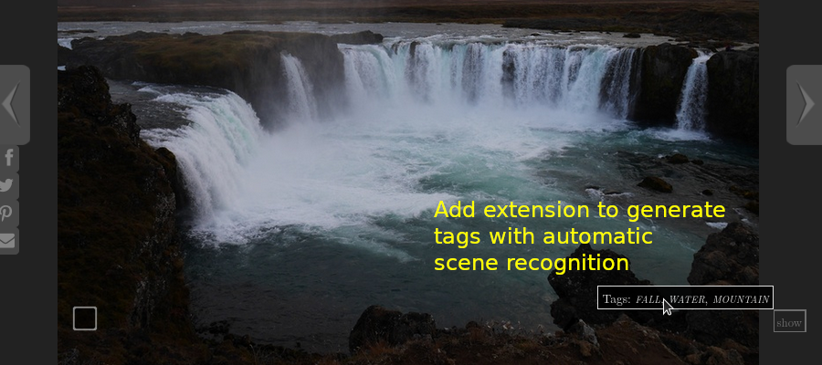
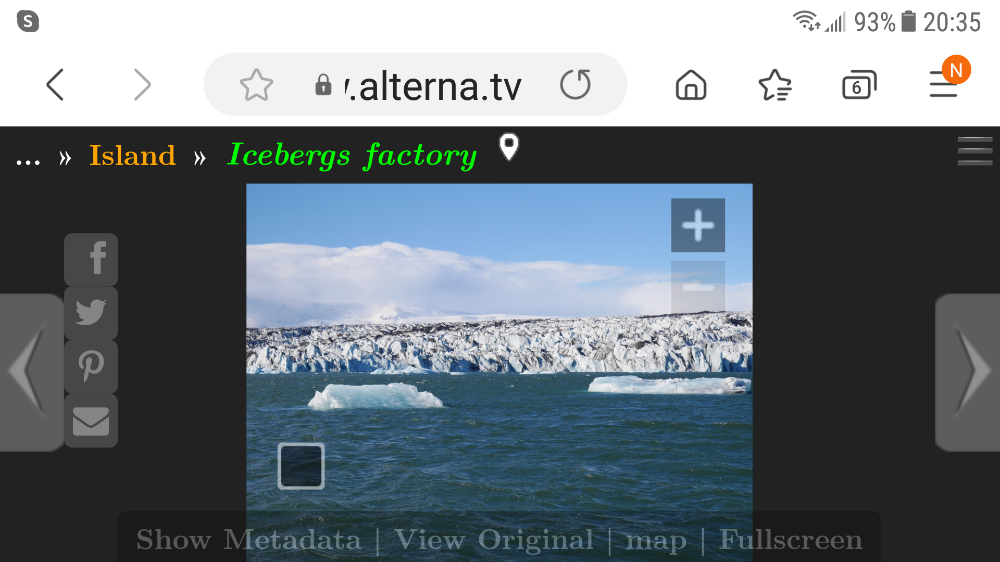

# MyPhotoShare v5.1.1 - A Static Web Photo Gallery with Advanced Features (May 10, 2021)

Expose your media (pictures and videos) on the web and share them with family and friends. Publish them on a fast and secure static web site.

[[_TOC_]]

## Static Website Does Not Mean Dummy Website

It's not because your photo gallery is in a static web site that it can't have advanced and user friendly features. We decided to make it static to be secure and fast but without features compromise!

| Sample | Features |
| -----: | :------- |
| **Open-Source Web Photo Gallery Aimed at Sleekness and Speed** The Python generator works over file directories rather than using a database. It creates static files. The result is a static, fast and secure web site.  [Discover More...](#performance) |  |
|  | **Navigate in Your Pictures and Videos as You Like** Browse media by folder, date, keywords or tags, geotags and map.  [Discover More...](doc/Metadata.md) |
| **Add Captions and Tags to Pictures and Videos** Enhance your media with descriptive metadata like date, title or description, GPS coordinates or tags.  [Discover More...](doc/GPS.md) |  |
|  | **Search Easily Media Content** Advanced media search by keywords in title, description or tags. You can specify how and where to search. |
| **Share Pictures with Friends and Family** Download files, share albums or media files by email or over social platforms.  [Discover More...](#share-pictures-with-friends) |  |
|  | **Customize the Gallery to Your Personal Look** Change the look of the gallery with options in the configuration file. Available in English, Italian, French and Spanish. Localizing to another language is easy.  [Discover More...](web/js/031-translations.js) |
| **Enhance it with Machine Learning Extensions** Install extensions for [automatic face recognition](https://gitlab.com/pmetras/mps_autofaces) in your pictures and automatically tag them. Or improve [scenes recognition](https://gitlab.com/pmetras/mps_autoscenes) to detect scenes in pictures.  [Discover More...](#add-a-touch-of-machine-learning-with-extensions) |  |
|  | **Mobile and Tablet Friendly** Get all these nice features from your phone or tablet.  [Discover More...](#a-mobile-friendly-media-gallery) |
| **Keep Your Pictures Secure and Private** Keep access to the gallery or some albums private, with password-restricted access.  [Discover More...](doc/Authentication.md) |  |

## A Long List of Features

### Show All Your Visual Media

- [x] Manage images and videos, share them (individual images or videos or full albums).
- [x] Media can be browsed by folder, by date or by geolocation. Switch between album, date and locations views.
- [x] Media and folders can be sorted ascending/descending, by date or by name.
- [x] Search media by file/album name, title, description or tags. Search whole word or inside words, considering accents and capitals or not, in current album (in virtual albums too) or in the whole albums tree.
- [x] Thumbnails can be square (cropped, with optional face detection by [OpenCV](https://opencv.org/)) or full-content.
- [x] Albums can be downloaded via the right `☰` menu, with or without subalbums, either images only, videos only, or both.
- [x] Pictures can be automatically indexed and tagged with ML-based extensions.

### Features For Photographers

- [x] Photos with GPS data can be browsed by country/region-state/place; names are retrieved in choosen language from [GeoNames](https://www.geonames.org/) web service.
- [x] Fullscreen mode.
- [x] EXIF, IPTC and XMP Metadata display.
- [x] Link to original media.
- [x] URL link for direct download.
- [x] Menu entries for direct download of whole album, with or without its subalbums.
- [x] Enlarge a picture without any limit.
- [x] Installer can decide whether to replicate all Exif metadata (including copyright info) into all the reductions/thumbnails or not.

[Discover more about metadata](doc/Metadata.md).

### Geotag Your Media

- [x] A popup map shows markers for the photos positions, using [Leaflet](https://leafletjs.com/).
- [x] Click on the map and the thumbnails for the nearest marker are shown.
- [x] More photos can be added (with shift-click) and removed (with ctl-click) from the popup map.
- [x] Photos shown in the popup map are clickable.
- [x] Near markers are automatically clustered, and the photos number is shown in the cluster marker.
- [x] Images collected by map clicks can be shown as an album, browsed and sorted.

[Discover more about GPS](doc/GPS.md).

### A Mobile Friendly Media Gallery

- [x] Swipe, pinch and drag gestures for mobile.
- [x] Sharp images and thumbnails on mobile.
- [x] Smooth media scaling.

### A Great User Interface

- [x] Keyboard navigation: arrows, pageup/down, `[esc]`, `[f]` (fullscreen), `[d]` (download original), `[o]` (show original), `[s]` (map), `[m]` (metadata), `[e]` (open right menu), `[+]` (pinch in), `[-]` (pinch out), space/backspace (like in [Darktable](https://www.darktable.org/)), `[>]`/`[<]` (rotation among browsing modes: folders -> by date -> by gps -> by search -> by map -> by selection), `[`/`]` (changing sort of albums in a rotative way), `{`/`}` (changing sort of media in a rotative way).
- [x] Keyboard dragging when the photo is zoomed in.
- [x] Mouse-wheel support, including for pinching (with ctrl or shift).
- [x] Numerous user interface options can be changed by the user.
- [x] Animations to make the interface feel nice.
- [x] Separate album view and photo view.
- [x] Media animation when passing to next/previous media.
- [x] Available in English, Italian, Spanish, French. User interface translated via separate translation file. Add your language!
- [x] Lazy thumbnails load for a faster page load.

[Discover more about keyboard navigation](doc/Navigation.md).

### Share Pictures With Friends

- [x] Share buttons for `facebook`, `whatsapp` (mobile only), `twitter`, `pinterest`, `email`; on `facebook`, `whatsapp` and `pinterest`: a preview of the image/album is shared.
- [x] Change for other social sites like `google`, `linkedin`, `tumbler`, `vk` or `buffer` in configuration.

### Tuned For Speed

- [x] Album metadata pre-fetching.
- [x] Photo pre-loading.
- [x] Scanner uses recursive async randomized tree walking album thumbnail algorithm.
- [x] HTML5 with minified CSS and JavaScript files for minimal load time.

### Control Access to Your Works

- [x] Albums and photo can be protected by passwords. Passwords may be specified for albums, for files or both.
- [x] Patterns are defined in album tree and specify what every password should protect; allowed matching modes: case sensitive/insensitive, whole/part of dir/file name, dir only/files only/both.
- [x] Passwords aren't exposed in javascript, and sensitive data and media are extremely difficult to find in cache.

[Discover more about protecting your media](doc/Authentication.md).

### Use Virtual Albums

**_New_ in [v5.0](doc/Features-5.0.md)**

- [x] Albums and media can be seleted via a click or massively, either in _hard_ albums (the default tree, by date, by location) and virtual ones (from search results, by gps or by map navigation).
- [x] Selected media and albums can be seen as an album, and can be browsed, downloaded, sorted, shown on map, etc.

### Add a Touch of Machine Learning with Extensions

**_New_ in [v5.0](doc/Features-5.0.md)**

- [x] Automatic face recognition in pictures with [mps_autofaces](https://gitlab.com/pmetras/mps_autofaces). Tag all family members automatically from a small sample of pictures...
- [x] Automatic scenes recognition and indexing in pictures with [mps_autoscenes](https://gitlab.com/pmetras/mps_autoscenes).

### And More...

- [x] Analytics with optional [Google Analytics](https://analytics.google.com/) and [Matomo](https://matomo.org/) integration.
- [x] Many customizations available through configuration file.
- [x] Cache folder is optimized with subdirs: useful for large repositories.
- [x] Source albums server folders can be anywhere on the server.
- [x] Prevent some folders (or trees) from being scanned by putting a marker inside them.
- [x] Scanner verbosity levels can be set in the configuration file.
- [x] Developer friendly with debug mode for using unminimized CSS and JavaScript files.
- [x] Photos metadata can be overloaded by user defined values in special `album.ini` files.
- [x] Consistent hash URL format.
- [x] Create Debian/Ubuntu package with [mps_debian](https://gitlab.com/pmetras/mps_debian) for easy install.

Find [answers to your remaining questions in the FAQ](doc/FAQ.md) and [in the documentation](doc).

## Try It By Yourself

- **[Primary demo site](https://myphotosharedemo.qumran2.net/)** - English UI with Multilingual content. Latest development version updated constantly to gitlab's development branch. Protected content available, the password is _pwd_.
- [Demo AlternaTV](https://www.alterna.tv/myphotoshare_demo/) - English UI with Multilingual content. Latest development version updated daily running on a netbook.
- [Assunta Palmaro](http://palmaro.qumran2.net/) - in Italian
- [Fiori](http://fiori.qumran2.net/) - in Italian

## Install It

### Debian/Ubuntu package

The easy way with the [Debian/Ubuntu package](https://gitlab.com/pmetras/mps_debian/-/releases). Install it with a command like `sudo dpkg -i myphotoshare_VERSION.deb` after changing for the `VERSION` you downloaded.

Then drop some pictures into `/usr/local/share/media` directory and wait for the scanner cron task to update the cache during the night.

Or start an update right now with the command `myphotoshare_scanner /etc/myphotoshare/myphotoshare.conf`. But perhaps you'll like to set a few personal options in the configuration file `/etc/myphotoshare/myphotoshare.conf` before...

### Detailed Manual Install

If you prefer to keep control and understand how it works, follow the [Setup and update instructions](https://gitlab.com/paolobenve/myphotoshare/-/blob/master/doc/Install.md). We'll explain how to get the latest revision from [Gitlab](https://gitlab.com/paolobenve/myphotoshare) and setup a web site step by step.

## Start Your Media Gallery in 6 Easy Steps

1. You must have a web server to display your gallery.
1. [Install MyPhotoShare](#install-it).
1. Adapt the configuration file [`myphotoshare.conf`](myphotoshare.conf.defaults) to your liking. At a minimum, you must change 3 settings to locate where are the media albums and where is the web content.
1. Drop pictures and videos into the `albums` directory.
1. Run MyPhotoShare scanner: look for `myphotoshare_scanner` command or `bin/scanner`. This populates MyPhotoShare cache and creates indexes.
1. When the scanner has completed successfully, aim your web browser at your web site and enjoy!

## Get and Give Help

Read the [documentation](doc). We explain advanced features there.

If it does not work as you expect, create an [issue on GitLab](https://gitlab.com/paolobenve/myphotoshare/-/issues). We'll try to help you.

Read the [source](https://gitlab.com/paolobenve/myphotoshare/) and contribute.

## Under The Hood: How Does It Work?

MyPhotoShare consists of two segments – a Python script and a JavaScript application.

The Python script scans a directory tree of images and videos (we use media as a general term), whereby each directory constitutes an album. It then populates a second folder, known as the cache folder with statically generated JSON files and thumbnails. It writes the `options.json` file too in the html root folder, putting inside it all the options from the configuration file. The scanner extracts metadata from EXIF tags in JPEG photos and other data from videos or `album.ini` user-defined files in albums to create JSON index files in the cache. MyPhotoShare is smart about file and directory modification time and it will be quite fast if there are few or zero changes since the last time you ran it.

The JavaScript application consists of a single `index.php` or `index.html` page. It fetches the `options.json` file and the statically generated JSON files and thumbnails on the fly from the cache folder to create a speedy interface.

### Performance

#### Scanner Performance

As a term of comparizon, on a medium-sized PC, with the images on a NFS mounted NAS partition:

- Scanning with face detection for the first time a 692 photos directory tree for a total size of 2.3 GB takes about 700 seconds (about 1 sec/media, 1 media/sec); face detection takes about 267 ms/photo.
- Re-scan of "all OK" tree of 36,000 media files for a total size of 87 GB takes about 14 minutes (20 ms/media, 50 media/sec) if not using checksums, and about 90 minutes (110 ms/media, 9 media/sec) when using checksums.
- Scanning for the first time about 40,000 photo with less than 100 videos takes about 5 hours with checksums enabled.
- Scanning of videos takes a much longer time than photos, the larger the videos the greater the time.

#### Memory Usage

Scanning 45,000 media requires no more than 1.5 GB/2.1 GB of resident/virtual memory.

#### Javascript Code

The javascript app is optimized, and it works fluently with 40,000 media!

However, showing an album or clicking on a marker with more than 1,000 photos, slowlyness is expected. Despite the slowlyness, everything ends correctly and is still usable.

#### Cache Size

Of course, static web performance is traded against cache size on disk. We tried to keep it reasonable. The cache size ratio to the original albums size depends on multiple factors, like the number of intermediate picture sizes you want (see option `reduced_sizes` in configuraton file) and the video encoding options (see `video_preset` for instance) or video length.

| Site                | Number of Media        | Album Size | Cache Size | Cache / Album Ratio |
| ------------------- | ---------------------- | ---------: | ---------: | ------------------: |
| AlternaTV Demo      | 95 pictures            |     675 MB |     116 MB |                 17% |
| Production Site # 1 | 14K media (20 videos)  |      95 GB |      25 GB |                 26% |
| Production Site # 2 | 20K media (439 videos) |      92 GB |      66 GB |                 71% |
| Production Site # 3 | 26K media (430 videos) |     232 GB |      82 GB |                 35% |

## MyPhotoShare History and License

**MyPhotoShare** is a [Jason A. Donenfeld's photofloat](https://git.zx2c4.com/PhotoFloat/about/) fork when Jason stopped development in 2016, enriched by Jerome Charaoui's patches to support videos, and Paolo Benvenuto and Pierre Métras following development.

It is free software licensed under the GNU General Public License v3, see [the license](LICENSE).
